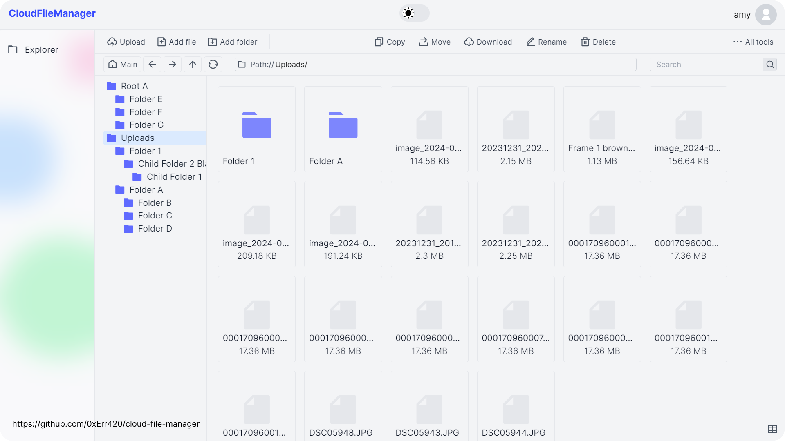
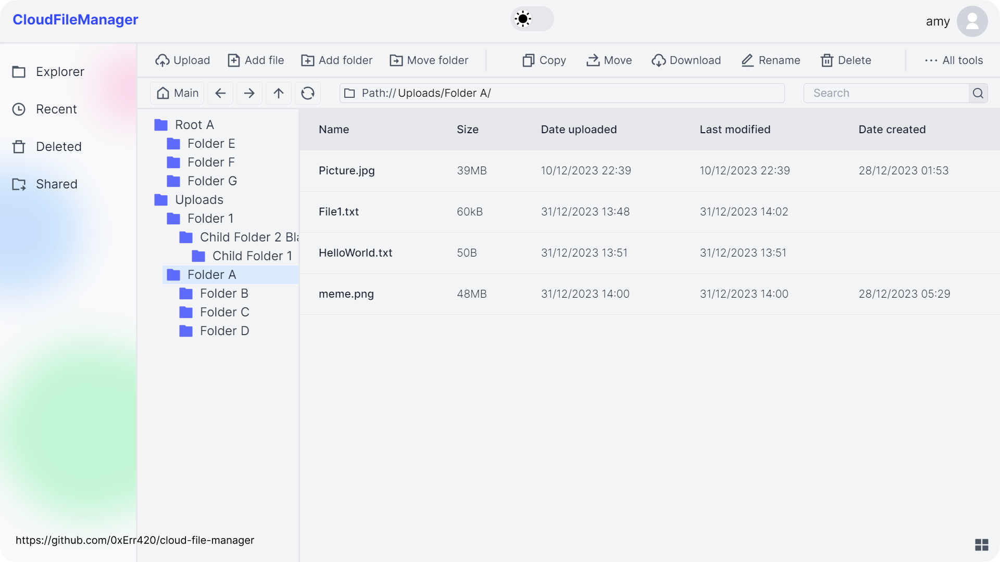
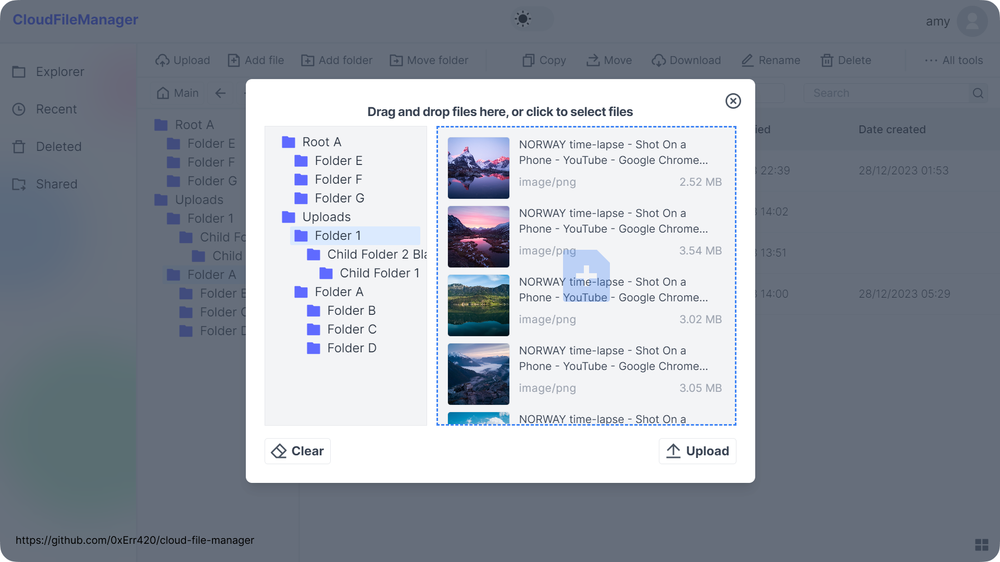
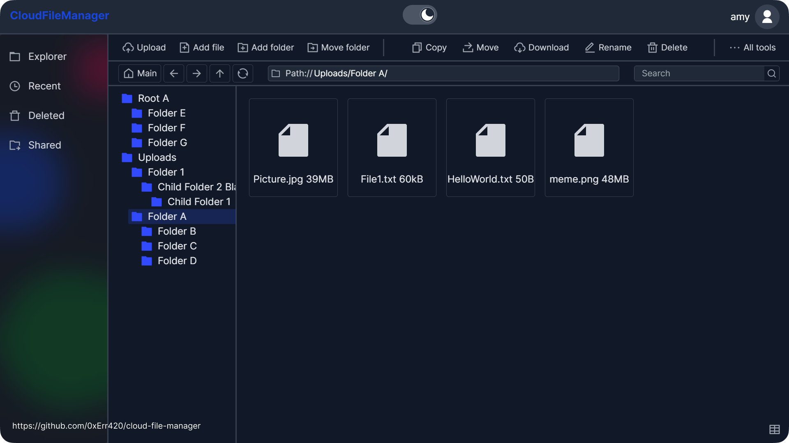
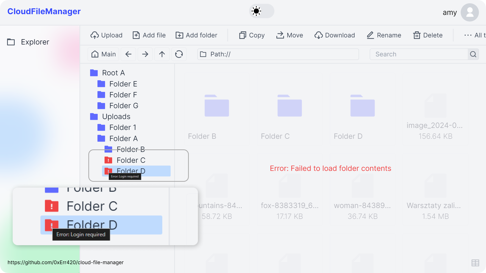
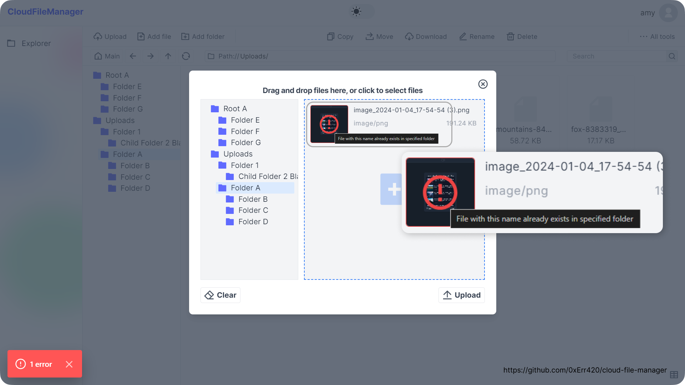

# CloudFileManager ☁️📂  

A **full-stack web application** that allows users to **securely upload, manage, and organize files** via an intuitive and responsive interface.  

  

---

## 🎯 **Project Goals**  

I built this project to: 
- Gain hands-on experience with **full-stack development**, ensuring the frontend and backend communicate efficiently. 
- Implement **JWT authentication** for secure user sessions and API communication. 
- Learn how to **handle file uploads, storage, and secure access control** in a web application. 
- Explore **Next.js for Single Page Applications (SPA)** with both **client-side and server-side rendering** for better performance. 
- Design a **beautiful and intuitive UI** using **Tailwind CSS**. 

---

## ✨ **Features**  

✅ **Secure Authentication** – JWT with HTTP-only cookies to prevent XSS attacks.  
✅ **File Upload & Management** – Upload, delete (soft & hard), and organize files easily.  
✅ **Error Handling & API Optimization** – Automatic retries, request throttling, and token refresh.  
✅ **Light/Dark Mode** – User-preferred theme switching.  
✅ **Optimized File Storage** – Smart upload, deduplication, and secure file access.  
✅ **RESTful APIs** – Built with Django REST Framework for handling authentication, file management, and user sessions.  
✅ **HTTPS Encryption** – Configured SSL certificates with enforced HTTPS for secure data transmission.  

---

## 🛠 **Tech Stack**  

- **Backend:** Django, Django REST Framework  
- **Frontend:** Next.js  
- **Styling:** Tailwind CSS  
- **Networking:** Axios  
- **Security:** JWT Authentication with HTTP-only cookies  
- **SSL:** mkcert for local HTTPS setup  

---

## 📸 **Screenshots**  

  
  
  
  
  
